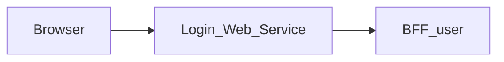

# Login_Web_Service — Technical documentation

[Module overview](module.md) · [Français](../fr/technical.md) · [README](../../README.md)

## Architecture and request handling

Next.js 15.5.25, React 19 and TypeScript application using the App Router. The browser calls same-origin routes; the Next.js server forwards data to **BFF_user**.



The page passes `PROJECT_FRONT_URL` to the Login component. `/api/auth/login` sends email, password and user-agent to BFF User. A 412 with a token becomes a `requiresPasswordChange` response; normal success requires a Bearer token in the upstream Authorization header. Password change maps `newPassword` to `new_password` and forwards the temporary token.

The generic proxy reads the versioned OpenAPI contract to allow paths and methods. It preserves query parameters, binary bodies, statuses and useful headers, filters transport headers, disables caching and does not automatically follow redirects. Its timeout is 15 seconds.

## Data and persistence

The following sources and limitations describe the associated BFF, which determines persistence for the displayed data.

Core supplies identity and session operations. The BFF SQL repositories also read users and roles and perform some password and group mutations. The first-sign-in flow uses PostgreSQL and Redis. Data access is therefore a mixture of HTTP and direct database operations.

Monitoring, backups, application logs and system policy described in administration requirements are not guaranteed by this contract. SQL access requires a compatible schema, including `group_members`; this name differs from `group_users` used in other contracts.

React state manages display and pending operations. This repository defines no business database of its own; save guarantees come from the BFF and its sources described above.

## Installation and local startup

Use Node.js 22 to reproduce the contract job and npm with the committed lockfile. Other job and Docker versions are detailed below.

Private `@mairie360/*` dependencies require GitHub Packages access. Set `NODE_AUTH_TOKEN` in the environment to a token allowed to read these packages, as configured in `.npmrc`. Do not commit its value.

```bash
npm ci
```

Create `.env.local` in the repository root. Example for BFFs running on the same machine:

```dotenv
BFF_USER_API_URL=http://localhost:4000
PROJECT_FRONT_URL=http://localhost:5001/
```

Start the associated BFF and BFF User for session flows, then start the web service. Port `5000` below is an explicit local choice to avoid collisions; it is not a claim about ports in every Compose file.

```bash
npm run dev -- --port 5000
```

Open `http://localhost:5000`. To run the build with the Next.js script:

```bash
npm run build
npm run start -- --port 5000
```

## Configuration

Values below are local examples or explicitly described behavior, not production credentials.

| Variable or precedence | Example / stated fallback | Purpose |
| --- | --- | --- |
| `BFF_USER_API_URL` → `USER_BFF_URL` | http://localhost:4000 | Left-to-right proxy precedence; the URL shown is the local fallback. |
| `BFF_CONTRACT_DIR` | ../BFF_user/contracts | BFF contract directory for synchronization and checking scripts. |
| `COOKIE_DOMAIN` | — | Cookie domain; keep it consistent with Login and BFF User. |
| `PROJECT_FRONT_URL` | — | Navigation destination; see the source file that reads it. Variables injected by `next.config.ts` or prefixed `NEXT_PUBLIC_` are public and consumed at build time. |

Inside a container, `localhost` refers to that container. Use the BFF service DNS name on the Docker network or a reachable host address. Compose files sometimes include other services and legacy settings; check effective URLs and ports before using them.

## Routes and data contract

Inventory extracted from `contracts/openapi.json`. Replace brace parameters with real identifiers. Detailed types, required fields, responses and any examples are defined in that contract; table statuses are the declared statuses, not an exhaustive list of transport or validation errors.

These data paths are exposed at the same origin through the proxy; Next.js pages are separate. `/openapi.json` and `/swagger.json` are also forwarded. Open the `/docs` Swagger UI directly on the BFF.

| Method | Path | Declared body | Declared statuses |
| --- | --- | --- | --- |
| GET | `/health` | — | 200 |
| GET | `/check_apis` | — | 200, 502 |
| POST | `/auth/login` | application/json | 200, 401, 412, 500 |
| POST | `/auth/register` | application/json | 201, 400, 409, 500 |
| POST | `/auth/force_change_password` | application/json | 204, 400, 401, 500 |
| POST | `/auth/logout` | — | 200, 500 |
| GET | `/user/{userId}/about` | — | 200, 400, 401, 500 |
| GET | `/bff/admin/users` | — | 200, 201, 204, 400, 401, 403, 404, 502 |
| POST | `/bff/admin/users` | application/json | 200, 201, 204, 400, 401, 403, 404, 502 |
| PATCH | `/bff/admin/users/{userId}` | application/json | 200, 201, 204, 400, 401, 403, 404, 502 |
| DELETE | `/bff/admin/users/{userId}` | — | 200, 201, 204, 400, 401, 403, 404, 502 |
| PATCH | `/bff/admin/users/{userId}/password` | application/json | 200, 201, 204, 400, 401, 403, 404, 502 |
| POST | `/bff/admin/users/{userId}/roles` | application/json | 200, 201, 204, 400, 401, 403, 404, 502 |
| DELETE | `/bff/admin/users/{userId}/roles/{roleId}` | — | 200, 201, 204, 400, 401, 403, 404, 502 |
| GET | `/bff/admin/roles` | — | 200, 201, 204, 400, 401, 403, 404, 502 |
| POST | `/bff/admin/roles` | application/json | 200, 201, 204, 400, 401, 403, 404, 502 |
| PUT | `/bff/admin/roles/{roleId}` | application/json | 200, 201, 204, 400, 401, 403, 404, 502 |
| PATCH | `/bff/admin/roles/{roleId}` | application/json | 200, 201, 204, 400, 401, 403, 404, 502 |
| DELETE | `/bff/admin/roles/{roleId}` | — | 200, 201, 204, 400, 401, 403, 404, 502 |
| GET | `/bff/admin/groups` | — | 200, 201, 204, 400, 401, 403, 404, 502 |
| POST | `/bff/admin/groups` | application/json | 200, 201, 204, 400, 401, 403, 404, 502 |
| GET | `/bff/admin/groups/{groupId}` | — | 200, 201, 204, 400, 401, 403, 404, 502 |
| PATCH | `/bff/admin/groups/{groupId}` | application/json | 200, 201, 204, 400, 401, 403, 404, 502 |
| DELETE | `/bff/admin/groups/{groupId}` | — | 200, 201, 204, 400, 401, 403, 404, 502 |
| GET | `/bff/admin/groups/{groupId}/users` | — | 200, 201, 204, 400, 401, 403, 404, 502 |
| POST | `/bff/admin/groups/{groupId}/users` | application/json | 200, 201, 204, 400, 401, 403, 404, 502 |
| DELETE | `/bff/admin/groups/{groupId}/users/{userId}` | — | 200, 201, 204, 400, 401, 403, 404, 502 |
| GET | `/bff/admin/sessions` | — | 200, 201, 204, 400, 401, 403, 404, 502 |
| GET | `/bff/admin/sessions/history` | — | 200, 201, 204, 400, 401, 403, 404, 502 |
| POST | `/bff/admin/sessions/refresh` | application/json | 200, 201, 204, 400, 401, 403, 404, 502 |
| POST | `/bff/admin/sessions/revoke` | application/json | 200, 201, 204, 400, 401, 403, 404, 502 |
| GET | `/me` | — | 200, 401 |
| GET | `/session/me` | — | 200, 401 |

### Pages and local adapters

| Page | Source |
| --- | --- |
| `/` | [src/app/page.tsx](../../src/app/page.tsx) |

| Method | Local route | Source |
| --- | --- | --- |
| POST | `/api/auth/force-change-password` | [src/app/api/auth/force-change-password/route.ts](../../src/app/api/auth/force-change-password/route.ts) |
| POST | `/api/auth/force_change_password` | [src/app/api/auth/force_change_password/route.ts](../../src/app/api/auth/force_change_password/route.ts) |
| POST | `/api/auth/login` | [src/app/api/auth/login/route.ts](../../src/app/api/auth/login/route.ts) |

## Session, permissions and errors

The `accessToken` cookie is HttpOnly, SameSite strict, scoped to `/`, has a 24-hour cookie lifetime and is Secure in production. It comes only from the sign-in response’s Bearer header, never from a refresh token. `passwordChangeToken` is HttpOnly, scoped to `/api/auth` and expires after 10 minutes. Successful password change removes that cookie; the sign-in flow must then be completed. Dedicated adapters have a 10-second timeout and distinguish 502 from 504.

The generic proxy returns 400 for an invalid path, 404 for a path outside the contract, 405 for a disallowed method and 502 when the service is unreachable or times out. Upstream responses are preserved, including empty 204/205/304 bodies.

## Synchronization and verification

After changing routes or schemas, export the contract in **BFF_user** using `npm run contracts:generate`, then run in this repository:

```bash
npm run contracts:sync
npm run contracts:check
npm run test:contracts
npm run lint
npm run build
```

`contracts:sync` copies the BFF contract and regenerates `src/contracts/bff.d.ts`. `contracts:check` also compares a neighboring BFF when present; in an isolated checkout, it checks types against the local committed snapshot. `test:contracts` runs the Node proxy tests and sign-in flow tests.

The type generator is pinned to `openapi-typescript@7.10.1` in `scripts/contracts.mjs` and runs through npm. For documentation-only changes, check links, accuracy in both languages and `git diff --check`; do not regenerate contracts without changing their source.

## CI/CD and Docker execution

The `contracts.yml` job uses Node.js 22, `actions/checkout@v7` and `actions/setup-node@v7`. It runs on pushes, pull requests and manual dispatch; it installs with `npm ci`, checks contracts and runs the associated tests.

`cicd.yml` calls `mairie360/CICD/.github/workflows/frontend-cicd.yml@v1.13.2`, with `cicd_version: v1.13.2` and `node_version: "23"`. Reusable steps and GitHub environments determine actual checks, publications and deployments.

The additional `nextjs.yml` workflow runs lint then build on Node.js 20 with checkout v7.0.1 and setup-node v7.0.0.

The Dockerfile defaults to `NODE_VERSION=23.1.0` and the Next.js `standalone` build; the image command is `["node", "server.js"]`. Image ports and Compose mappings can differ from the local port suggested above.

Before running Docker, check service variables, build secrets and networks in the repository files. Green CI validates its jobs; it does not prove business-service availability in a remote environment.

## Troubleshooting

Associated BFF diagnostics: If sign-in works but administration fails, check `JWT_SECRET`, the stored role and SQL access. If first-sign-in password change fails, check Redis, the temporary token and PostgreSQL.

For a proxy error, compare the path and method with the inventory, then check the BFF URL and session. For a 401 after navigating between modules, check the `accessToken` cookie, its domain and BFF User. A 404 for a requirement described in `BACKEND.md` may refer to a feature that is only proposed.

## Repository reference

- [src/app/page.tsx](../../src/app/page.tsx)
- [src/components/Login.tsx](../../src/components/Login.tsx)
- [src/app/api/auth/login/route.ts](../../src/app/api/auth/login/route.ts)
- [src/app/api/auth/force-change-password/route.ts](../../src/app/api/auth/force-change-password/route.ts)
- [src/lib/bff-proxy.ts](../../src/lib/bff-proxy.ts)
- [src/app/[...path]/route.ts](../../src/app/%5B...path%5D/route.ts)
- [contracts/openapi.json](../../contracts/openapi.json)
- [src/contracts/bff.d.ts](../../src/contracts/bff.d.ts)
- [scripts/contracts.mjs](../../scripts/contracts.mjs)
- [package.json](../../package.json)
- [.github/workflows/contracts.yml](../../.github/workflows/contracts.yml)
- [.github/workflows/cicd.yml](../../.github/workflows/cicd.yml)
- [Dockerfile](../../Dockerfile)
- [docker-compose.yml](../../docker-compose.yml)

Historical supplements: [BFF.md](../../BFF.md), [BACKEND.md](../../BACKEND.md). Proposed requirements must remain distinct from implemented behavior.
