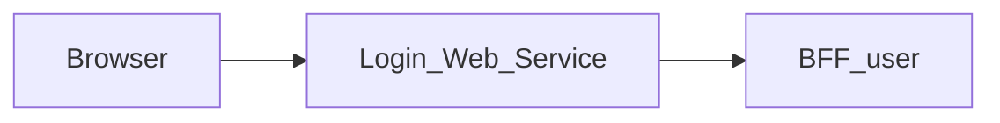

# Login_Web_Service — Technical documentation

## Explicit frontend destinations (MAIR-177)

Frontend redirects use only explicitly configured HTTP(S) URLs without embedded
credentials. There is no implicit localhost destination. Set the existing
`LOGIN_FRONT_URL` (protected fronts) and `PROJECT_FRONT_URL` (Login default)
at runtime, including local development. A valid configured return destination
may still be used by Login when its default is absent. Invalid or missing
Login destinations produce an uncached HTTP 503 message in the middleware;
Login itself displays an unavailable state without a form when no destination
can be resolved. No BFF/API contract or deployment variable is added.


[Module overview](module.md) · [Français](../fr/technical.md) · [README](../../README.md)

## Architecture and request handling

Next.js 15.5.25, React 19 and TypeScript application using the App Router. The browser calls same-origin routes; the Next.js server forwards data to **BFF_user**.



The page validates its `redirect` query parameter on the server: only an absolute HTTP(S) URL whose origin matches a configured `*_FRONT_URL` is accepted; otherwise it uses `PROJECT_FRONT_URL`. The validated destination is used after normal sign-in and first-sign-in password change. `/api/auth/login` checks email format and non-empty password before calling BFF User, then sends email, password and user-agent (never empty, as `LoginView` requires) to BFF User. A 412 with a token becomes a `requiresPasswordChange` response; normal success requires a Bearer token in the upstream Authorization header. Password change maps `newPassword` to `new_password` and forwards the temporary token; a 401 or 403 (token refused or expired) clears it and asks to sign in again. Upstream statuses are kept, but the displayed message is chosen by the front from the status: BFF User messages are technical and in English.

The generic proxy reads the versioned OpenAPI contract to allow paths and methods. It preserves query parameters, binary bodies, statuses and useful headers, filters transport headers, disables caching and does not automatically follow redirects. Its timeout is 15 seconds.

## Data and persistence

The following sources and limitations describe the associated BFF, which determines persistence for the displayed data.

Core supplies identity and session operations. The BFF SQL repositories also read users and roles and perform some password and group mutations. The first-sign-in flow uses PostgreSQL and Redis. Data access is therefore a mixture of HTTP and direct database operations.

Monitoring, backups, application logs and system policy described in administration requirements are not guaranteed by this contract. SQL access requires a compatible schema, including `group_members`; this name differs from `group_users` used in other contracts.

React state manages display and pending operations. This repository defines no business database of its own; save guarantees come from the BFF and its sources described above.

## Installation and local startup

Use Node.js 22 to reproduce the contract job and npm with the committed lockfile. Other job and Docker versions are detailed below.

Private `@mairie360/*` dependencies require GitHub Packages access. Set `NODE_AUTH_TOKEN` in the environment to a token allowed to read these packages, as configured in `.npmrc`. Do not commit its value.

```bash
npm ci
```

Create `.env.local` in the repository root. Example for BFFs running on the same machine:

```dotenv
BFF_USER_API_URL=http://localhost:4000
PROJECT_FRONT_URL=http://localhost:5001/
```

Start BFF User, the only BFF this web service calls, then start the web service. Port `5000` below is an explicit local choice to avoid collisions; it is not a claim about ports in every Compose file.

```bash
npm run dev -- --port 5000
```

Open `http://localhost:5000`. To run the build with the Next.js script:

```bash
npm run build
npm run start -- --port 5000
```

## Configuration

Values below are local examples or explicitly described behavior, not production credentials.

| Variable or precedence | Example / stated fallback | Purpose |
| --- | --- | --- |
| `BFF_USER_API_URL` → `USER_BFF_URL` | http://localhost:4000 | Left-to-right precedence; explicitly configure an HTTP(S) URL. Missing or invalid configuration returns an uncached 503 without an upstream call. |
| `COOKIE_DOMAIN` | — | Cookie domain; keep it consistent with Login and BFF User. |
| `PROJECT_FRONT_URL` | — | Default destination when `redirect` is absent or invalid. |
| `*_FRONT_URL` | — | Runtime-configured public front origins accepted for the `redirect` destination; these values are read on the server, not sent to the browser. |

Inside a container, `localhost` refers to that container. Use the BFF service DNS name on the Docker network or a reachable host address. Compose files sometimes include other services and legacy settings; check effective URLs and ports before using them.

## Routes and data contract

Inventory extracted from `contracts/openapi.json`, rebuilt from the published `@mairie360/bff-user-openapi` package pinned in `package.json`. Replace brace parameters with real identifiers. Detailed types and required fields are defined in that contract. The package (orval output) only types success responses, shown as `2XX`, plus responses modelled per status such as `412`: errors, formats and response headers are not part of it.

These data paths are exposed at the same origin through the proxy; Next.js pages are separate. `/openapi.json` and `/swagger.json` are also forwarded. Open the `/docs` Swagger UI directly on the BFF.

| Method | Path | Declared body | Declared statuses |
| --- | --- | --- | --- |
| POST | `/auth/force_change_password` | application/json | 2XX |
| POST | `/auth/login` | application/json | 2XX, 412 |
| POST | `/auth/logout` | — | 2XX |
| POST | `/auth/register` | application/json | 2XX |
| GET | `/bff/admin/groups` | — | 2XX |
| POST | `/bff/admin/groups` | application/json | 2XX |
| DELETE | `/bff/admin/groups/{groupId}` | — | 2XX |
| GET | `/bff/admin/groups/{groupId}` | — | 2XX |
| PATCH | `/bff/admin/groups/{groupId}` | application/json | 2XX |
| GET | `/bff/admin/groups/{groupId}/users` | — | 2XX |
| POST | `/bff/admin/groups/{groupId}/users` | application/json | 2XX |
| DELETE | `/bff/admin/groups/{groupId}/users/{userId}` | — | 2XX |
| GET | `/bff/admin/roles` | — | 2XX |
| POST | `/bff/admin/roles` | application/json | 2XX |
| DELETE | `/bff/admin/roles/{roleId}` | — | 2XX |
| PATCH | `/bff/admin/roles/{roleId}` | application/json | 2XX |
| PUT | `/bff/admin/roles/{roleId}` | application/json | 2XX |
| GET | `/bff/admin/sessions` | — | 2XX |
| GET | `/bff/admin/sessions/history` | — | 2XX |
| POST | `/bff/admin/sessions/refresh` | application/json | 2XX |
| POST | `/bff/admin/sessions/revoke` | application/json | 2XX |
| GET | `/bff/admin/users` | — | 2XX |
| POST | `/bff/admin/users` | application/json | 2XX |
| DELETE | `/bff/admin/users/{userId}` | — | 2XX |
| PATCH | `/bff/admin/users/{userId}` | application/json | 2XX |
| PATCH | `/bff/admin/users/{userId}/password` | application/json | 2XX |
| POST | `/bff/admin/users/{userId}/roles` | application/json | 2XX |
| DELETE | `/bff/admin/users/{userId}/roles/{roleId}` | — | 2XX |
| GET | `/check_apis` | — | 2XX |
| GET | `/health` | — | 2XX |
| GET | `/me` | — | 2XX |
| GET | `/session/me` | — | 2XX |
| GET | `/user/{userId}/about` | — | 2XX |

### Pages and local adapters

| Page | Source |
| --- | --- |
| `/` | [src/app/page.tsx](../../src/app/page.tsx) |

| Method | Local route | Source |
| --- | --- | --- |
| POST | `/api/auth/force-change-password` | [src/app/api/auth/force-change-password/route.ts](../../src/app/api/auth/force-change-password/route.ts) |
| POST | `/api/auth/force_change_password` | [src/app/api/auth/force_change_password/route.ts](../../src/app/api/auth/force_change_password/route.ts) |
| POST | `/api/auth/login` | [src/app/api/auth/login/route.ts](../../src/app/api/auth/login/route.ts) |

## Session, permissions and errors

The `accessToken` cookie is HttpOnly, SameSite strict, scoped to `/`, has a 24-hour cookie lifetime and is Secure in production. It comes only from the sign-in response’s Bearer header, never from a refresh token. `passwordChangeToken` is HttpOnly, scoped to `/api/auth` and expires after 10 minutes. Successful password change removes that cookie; the sign-in flow must then be completed. Dedicated adapters have a 10-second timeout and distinguish 502 from 504.

The generic proxy returns 400 for an invalid path, 404 for a path outside the contract, 405 for a disallowed method and 502 when the service is unreachable or times out. Upstream responses are preserved, including empty 204/205/304 bodies.

Every response carries `X-Frame-Options: DENY`, `X-Content-Type-Options: nosniff`, `Referrer-Policy`, `Permissions-Policy` and `Cross-Origin-Resource-Policy`, `Cross-Origin-Embedder-Policy` and `Cross-Origin-Opener-Policy` (`next.config.ts`), and `X-Powered-By` is disabled. [src/middleware.ts](../../src/middleware.ts) adds a `Content-Security-Policy` with a per-request nonce to every page (the sign-in page is public, so there is no authentication gate), which Next.js applies to its scripts. Pages are therefore rendered on demand (`dynamic = "force-dynamic"` in the layout). Stylesheets are limited to the origin and the nonce; only `style` attributes rendered by shared components are allowed through `style-src-attr 'unsafe-inline'`, and `next dev` also allows `'unsafe-eval'`. Any new external resource (image, font, API called from the browser) must be added to the policy in `src/lib/content-security-policy.ts`.

## Synchronization and verification

The only contract is BFF User’s, as **published** in `@mairie360/bff-user-openapi`, pinned to an exact `X.Y.Z` version (never a `0.0.0-dev`/`staging` pre-release, never a copy from a BFF checkout, which can be ahead of the release). After a new BFF User release:

```bash
npm install --save-exact @mairie360/bff-user-openapi@X.Y.Z
npm run contracts:sync
npm run contracts:check
npm test
npm run lint
npm run build
```

The package contains orval TypeScript, not `openapi.json`: [scripts/orval-contract.mjs](../../scripts/orval-contract.mjs) rebuilds the OpenAPI document from it and `contracts:sync` writes it to `contracts/openapi.json` (read by the proxy and the tests). `contracts:check` fails if the version is not exact, if the installed package differs from `package.json`, if a second `@mairie360/bff-*-openapi` package appears or if the snapshot is stale. Route handlers import their types from `@mairie360/bff-user-openapi/model`. Also move the `bff-user` image tag of the `docker-compose*.yml` files to the same version. `npm test` runs the Node tests and fails below 60% line, branch or function coverage of `src/**` (`test:contracts` runs the same tests without coverage).

Unit tests run the route handlers and the proxy with the real `fetch` against a fake BFF User served over HTTP ([tests/support/contract-mock-server.cjs](../../tests/support/contract-mock-server.cjs)) and driven by `contracts/openapi.json`: any request outside the contract (path, method, parameter, body), any mocked response that does not match its declared status, or any call to another origin fails the test. Error responses, which the package does not type, are checked against its `ApiErrorResponse` model. Every contract operation is exercised through the proxy. [tests/network-calls.test.cjs](../../tests/network-calls.test.cjs) inventories every network call in `src/` (server and browser): each must target a contract operation or a local route handler, BFF User is the only BFF and the proxy is the only dynamic call allowed. [tests/package-contract.test.cjs](../../tests/package-contract.test.cjs) checks the exact version, the snapshot and the Docker image tags. Coverage only counts modules loaded by a test; React components (`.tsx`) are not measured.

For documentation-only changes, check links, accuracy in both languages and `git diff --check`; do not regenerate contracts without changing the package version.

## CI/CD and Docker execution

The `contracts.yml` job uses Node.js 22, `actions/checkout@v7` and `actions/setup-node@v7`. It runs on pushes, pull requests and manual dispatch; it installs with `npm ci`, checks contracts and runs the associated tests.

`cicd.yml` calls `mairie360/CICD/.github/workflows/frontend-cicd.yml@v2.0.0`, with `cicd_version: v2.0.0` and `node_version: "23"`. Reusable steps and GitHub environments determine actual checks, publications and deployments.

The additional `nextjs.yml` workflow runs lint then build on Node.js 20 with checkout v7.0.1 and setup-node v7.0.0.

The Dockerfile defaults to `NODE_VERSION=23.1.0` and the Next.js `standalone` build; the image command is `["node", "server.js"]`. Image ports and Compose mappings can differ from the local port suggested above.

Before running Docker, check service variables, build secrets and networks in the repository files. Green CI validates its jobs; it does not prove business-service availability in a remote environment.

## Troubleshooting

Associated BFF diagnostics: If sign-in works but administration fails, check `JWT_SECRET`, the stored role and SQL access. If first-sign-in password change fails, check Redis, the temporary token and PostgreSQL.

For a proxy error, compare the path and method with the inventory, then check the BFF URL and session. For a 401 after navigating between modules, check the `accessToken` cookie, its domain and BFF User. A 404 for a requirement described in `BACKEND.md` may refer to a feature that is only proposed.

## Repository reference

- [src/app/page.tsx](../../src/app/page.tsx)
- [src/components/Login.tsx](../../src/components/Login.tsx)
- [src/app/api/auth/login/route.ts](../../src/app/api/auth/login/route.ts)
- [src/app/api/auth/force-change-password/route.ts](../../src/app/api/auth/force-change-password/route.ts)
- [src/lib/bff-proxy.ts](../../src/lib/bff-proxy.ts)
- [src/app/[...path]/route.ts](../../src/app/%5B...path%5D/route.ts)
- [contracts/openapi.json](../../contracts/openapi.json)
- [scripts/orval-contract.mjs](../../scripts/orval-contract.mjs)
- [scripts/contracts.mjs](../../scripts/contracts.mjs)
- [package.json](../../package.json)
- [.github/workflows/contracts.yml](../../.github/workflows/contracts.yml)
- [.github/workflows/cicd.yml](../../.github/workflows/cicd.yml)
- [Dockerfile](../../Dockerfile)
- [docker-compose.yml](../../docker-compose.yml)

Historical supplements: [BFF.md](../../BFF.md), [BACKEND.md](../../BACKEND.md). Proposed requirements must remain distinct from implemented behavior.
