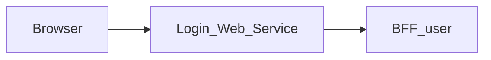

# Login_Web_Service — Documentation technique

[Présentation du module](module.md) · [English](../en/technical.md) · [README](../../README.md)

Documentation du code versionné au 7 septembre 2026, basée sur `c71c7640f53f`. Les commandes ci-dessous décrivent les vérifications à effectuer; elles ne certifient pas un déploiement distant.

## Architecture et traitement des requêtes

Application Next.js 15.5.25, React 19 et TypeScript avec App Router. Le navigateur appelle les routes de la même origine; le serveur Next.js relaie les données vers **BFF_user**.



La page transmet `PROJECT_FRONT_URL` au composant Login. `/api/auth/login` envoie e-mail, mot de passe et user-agent à BFF User. Un 412 avec jeton devient une réponse `requiresPasswordChange`; un succès normal exige un Bearer dans l’en-tête Authorization amont. Le changement de mot de passe adapte `newPassword` en `new_password` et transmet le jeton temporaire.

Le proxy générique lit le contrat OpenAPI versionné pour autoriser chemins et méthodes. Il conserve paramètres de requête, corps binaire, statuts et en-têtes utiles, filtre les en-têtes de transport, désactive le cache et n’effectue pas de suivi automatique des redirections. Son délai est de 15 secondes.

## Données et persistance

Les sources et limites suivantes concernent le BFF associé, dont dépend la sauvegarde des données affichées.

Core fournit les opérations d’identité et de session. Les dépôts SQL du BFF lisent aussi les utilisateurs et rôles, et réalisent certaines mutations de mots de passe et de groupes. Le parcours de première connexion utilise PostgreSQL et Redis. Les données ne sont donc pas toutes accessibles exclusivement par HTTP.

Les fonctions de supervision, sauvegarde, journaux applicatifs et politique système décrites dans les besoins d’administration ne sont pas garanties par ce contrat. Les accès SQL exigent un schéma compatible, notamment `group_members`; ne pas confondre ce nom avec `group_users` utilisé dans d’autres contrats.

L’état React gère l’affichage et les opérations en cours. Ce dépôt ne définit pas de base métier propre; les garanties de sauvegarde sont celles du BFF et de ses sources décrites ci-dessus.

## Installation et lancement local

Utiliser Node.js 22 pour reproduire le job de contrats et npm avec le fichier de verrouillage versionné. Les versions des autres jobs et de Docker sont précisées plus bas.

Les dépendances privées `@mairie360/*` nécessitent un accès GitHub Packages. Configurer `NODE_AUTH_TOKEN` dans l’environnement avec un jeton autorisé à lire ces packages, conformément à `.npmrc`. Ne pas enregistrer la valeur dans Git.

```bash
npm ci
```

Créer `.env.local` à la racine. Exemple pour des BFF exécutés sur la même machine:

```dotenv
BFF_USER_API_URL=http://localhost:4000
PROJECT_FRONT_URL=http://localhost:5001/
```

Démarrer le BFF associé et BFF User pour les parcours de session, puis lancer le web service. Le port `5000` ci-dessous est un choix local explicite pour éviter les collisions; ce n’est pas une affirmation sur les ports de tous les fichiers Compose.

```bash
npm run dev -- --port 5000
```

Ouvrir `http://localhost:5000`. Pour exécuter le build avec le script Next.js:

```bash
npm run build
npm run start -- --port 5000
```

## Configuration

Les valeurs ci-dessous sont des exemples locaux ou des comportements explicitement indiqués, pas des identifiants de production.

| Variable ou priorité | Exemple / repli indiqué | Rôle |
| --- | --- | --- |
| `BFF_USER_API_URL` → `USER_BFF_URL` | http://localhost:4000 | Priorité de gauche à droite dans le proxy; l’URL indiquée est le repli local. |
| `BFF_CONTRACT_DIR` | ../BFF_user/contracts | Répertoire des contrats BFF pour les scripts de synchronisation et de contrôle. |
| `COOKIE_DOMAIN` | — | Domaine des cookies; vérifier sa cohérence avec Login et BFF User. |
| `PROJECT_FRONT_URL` | — | Destination de navigation; voir le fichier source qui la lit. Les variables injectées par `next.config.ts` ou préfixées `NEXT_PUBLIC_` sont publiques et prises en compte lors du build. |

Dans un conteneur, `localhost` désigne le conteneur lui-même. Utiliser le nom DNS du service BFF sur le réseau Docker, ou une adresse d’hôte accessible. Les fichiers Compose incluent parfois d’autres services et des paramètres hérités; vérifier les URL et ports effectifs avant de les employer.

## Routes et contrat de données

Inventaire extrait de `contracts/openapi.json`. Les paramètres entre accolades sont remplacés par des identifiants réels. Les types détaillés, champs requis, réponses et exemples éventuels sont définis dans ce contrat; les statuts du tableau sont ceux déclarés, sans prétendre lister toutes les erreurs de transport ou de validation.

Ces chemins de données sont exposés à la même origine par le proxy; les pages Next.js sont distinctes. `/openapi.json` et `/swagger.json` sont également relayés. L’interface Swagger `/docs` se consulte directement sur le BFF.

| Méthode | Chemin | Corps déclaré | Statuts déclarés |
| --- | --- | --- | --- |
| GET | `/health` | — | 200 |
| GET | `/check_apis` | — | 200, 502 |
| POST | `/auth/login` | application/json | 200, 401, 412, 500 |
| POST | `/auth/register` | application/json | 201, 400, 409, 500 |
| POST | `/auth/force_change_password` | application/json | 204, 400, 401, 500 |
| POST | `/auth/logout` | — | 200, 500 |
| GET | `/user/{userId}/about` | — | 200, 400, 401, 500 |
| GET | `/bff/admin/users` | — | 200, 201, 204, 400, 401, 403, 404, 502 |
| POST | `/bff/admin/users` | application/json | 200, 201, 204, 400, 401, 403, 404, 502 |
| PATCH | `/bff/admin/users/{userId}` | application/json | 200, 201, 204, 400, 401, 403, 404, 502 |
| DELETE | `/bff/admin/users/{userId}` | — | 200, 201, 204, 400, 401, 403, 404, 502 |
| PATCH | `/bff/admin/users/{userId}/password` | application/json | 200, 201, 204, 400, 401, 403, 404, 502 |
| POST | `/bff/admin/users/{userId}/roles` | application/json | 200, 201, 204, 400, 401, 403, 404, 502 |
| DELETE | `/bff/admin/users/{userId}/roles/{roleId}` | — | 200, 201, 204, 400, 401, 403, 404, 502 |
| GET | `/bff/admin/roles` | — | 200, 201, 204, 400, 401, 403, 404, 502 |
| POST | `/bff/admin/roles` | application/json | 200, 201, 204, 400, 401, 403, 404, 502 |
| PUT | `/bff/admin/roles/{roleId}` | application/json | 200, 201, 204, 400, 401, 403, 404, 502 |
| PATCH | `/bff/admin/roles/{roleId}` | application/json | 200, 201, 204, 400, 401, 403, 404, 502 |
| DELETE | `/bff/admin/roles/{roleId}` | — | 200, 201, 204, 400, 401, 403, 404, 502 |
| GET | `/bff/admin/groups` | — | 200, 201, 204, 400, 401, 403, 404, 502 |
| POST | `/bff/admin/groups` | application/json | 200, 201, 204, 400, 401, 403, 404, 502 |
| GET | `/bff/admin/groups/{groupId}` | — | 200, 201, 204, 400, 401, 403, 404, 502 |
| PATCH | `/bff/admin/groups/{groupId}` | application/json | 200, 201, 204, 400, 401, 403, 404, 502 |
| DELETE | `/bff/admin/groups/{groupId}` | — | 200, 201, 204, 400, 401, 403, 404, 502 |
| GET | `/bff/admin/groups/{groupId}/users` | — | 200, 201, 204, 400, 401, 403, 404, 502 |
| POST | `/bff/admin/groups/{groupId}/users` | application/json | 200, 201, 204, 400, 401, 403, 404, 502 |
| DELETE | `/bff/admin/groups/{groupId}/users/{userId}` | — | 200, 201, 204, 400, 401, 403, 404, 502 |
| GET | `/bff/admin/sessions` | — | 200, 201, 204, 400, 401, 403, 404, 502 |
| GET | `/bff/admin/sessions/history` | — | 200, 201, 204, 400, 401, 403, 404, 502 |
| POST | `/bff/admin/sessions/refresh` | application/json | 200, 201, 204, 400, 401, 403, 404, 502 |
| POST | `/bff/admin/sessions/revoke` | application/json | 200, 201, 204, 400, 401, 403, 404, 502 |
| GET | `/me` | — | 200, 401 |
| GET | `/session/me` | — | 200, 401 |

### Pages et adaptateurs locaux

| Page | Source |
| --- | --- |
| `/` | [src/app/page.tsx](../../src/app/page.tsx) |

| Méthode | Route locale | Source |
| --- | --- | --- |
| POST | `/api/auth/force-change-password` | [src/app/api/auth/force-change-password/route.ts](../../src/app/api/auth/force-change-password/route.ts) |
| POST | `/api/auth/force_change_password` | [src/app/api/auth/force_change_password/route.ts](../../src/app/api/auth/force_change_password/route.ts) |
| POST | `/api/auth/login` | [src/app/api/auth/login/route.ts](../../src/app/api/auth/login/route.ts) |

## Session, permissions et erreurs

Le cookie `accessToken` est HttpOnly, SameSite strict, limité à `/`, valable 24 heures côté cookie et Secure en production. Il provient uniquement de l’en-tête Bearer de la réponse de connexion, jamais d’un refresh token. `passwordChangeToken` est HttpOnly, limité à `/api/auth` et expire après 10 minutes. Le succès du changement de mot de passe supprime ce cookie; il faut ensuite terminer le parcours de connexion. Les adaptateurs dédiés ont un délai de 10 secondes et distinguent 502 et 504.

Le proxy générique répond 400 pour un chemin invalide, 404 pour un chemin hors contrat, 405 pour une méthode interdite et 502 si le service est injoignable ou dépasse le délai. Les réponses amont sont conservées, y compris les corps vides 204/205/304.

## Synchronisation et vérifications

Après une modification de routes ou de schémas, exporter le contrat dans **BFF_user** avec `npm run contracts:generate`, puis exécuter dans ce dépôt:

```bash
npm run contracts:sync
npm run contracts:check
npm run test:contracts
npm run lint
npm run build
```

`contracts:sync` copie le contrat BFF et régénère `src/contracts/bff.d.ts`. `contracts:check` compare aussi le BFF voisin lorsqu’il est présent; dans un checkout isolé, il vérifie les types contre la copie locale versionnée. `test:contracts` exécute les tests Node du proxy et des parcours de connexion.

Le générateur de types est fixé à `openapi-typescript@7.10.1` dans `scripts/contracts.mjs` et s’exécute via npm. Pour une modification uniquement documentaire, vérifier les liens, l’exactitude des deux langues et `git diff --check`; ne pas régénérer les contrats sans modification de leur source.

## CI/CD et exécution Docker

Le job `contracts.yml` utilise Node.js 22, `actions/checkout@v7` et `actions/setup-node@v7`. Il s’exécute sur push, pull request et lancement manuel; il installe avec `npm ci`, contrôle les contrats et lance les tests dédiés.

`cicd.yml` appelle `mairie360/CICD/.github/workflows/frontend-cicd.yml@v1.13.2`, avec `cicd_version: v1.13.2` et `node_version: "23"`. Les étapes réutilisables et les environnements GitHub déterminent les contrôles, publications et déploiements effectifs.

Le workflow additionnel `nextjs.yml` exécute lint puis build sur Node.js 20 avec checkout v7.0.1 et setup-node v7.0.0.

Le Dockerfile utilise par défaut `NODE_VERSION=23.1.0` et le build Next.js `standalone`; la commande de l’image est `["node", "server.js"]`. Le port de l’image et les mappings Compose peuvent différer du port local proposé plus haut.

Avant un lancement Docker, vérifier les variables de service, les secrets de build et les réseaux dans les fichiers du dépôt. Une CI verte valide ses jobs; elle ne prouve pas la disponibilité des services métier dans un environnement distant.

## Diagnostic

Diagnostic du BFF associé: Si la connexion fonctionne mais que l’administration échoue, vérifier la configuration `JWT_SECRET`, le rôle enregistré et l’accès SQL. Si le changement de première connexion échoue, vérifier Redis, le jeton temporaire et PostgreSQL.

En cas d’erreur de proxy, comparer la route et la méthode à l’inventaire, vérifier l’URL du BFF puis la session. Pour un 401 après navigation entre modules, vérifier le cookie `accessToken`, son domaine et le service BFF User. Un 404 sur un besoin décrit dans `BACKEND.md` peut correspondre à une fonctionnalité seulement proposée.

## Repères dans le dépôt

- [src/app/page.tsx](../../src/app/page.tsx)
- [src/components/Login.tsx](../../src/components/Login.tsx)
- [src/app/api/auth/login/route.ts](../../src/app/api/auth/login/route.ts)
- [src/app/api/auth/force-change-password/route.ts](../../src/app/api/auth/force-change-password/route.ts)
- [src/lib/bff-proxy.ts](../../src/lib/bff-proxy.ts)
- [src/app/[...path]/route.ts](../../src/app/%5B...path%5D/route.ts)
- [contracts/openapi.json](../../contracts/openapi.json)
- [src/contracts/bff.d.ts](../../src/contracts/bff.d.ts)
- [scripts/contracts.mjs](../../scripts/contracts.mjs)
- [package.json](../../package.json)
- [.github/workflows/contracts.yml](../../.github/workflows/contracts.yml)
- [.github/workflows/cicd.yml](../../.github/workflows/cicd.yml)
- [Dockerfile](../../Dockerfile)
- [docker-compose.yml](../../docker-compose.yml)

Compléments historiques: [BFF.md](../../BFF.md), [BACKEND.md](../../BACKEND.md). Les besoins proposés doivent rester distincts du comportement effectivement implémenté.
